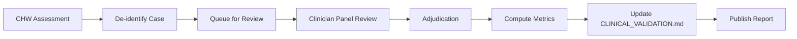

# Clinical Validation Framework

**Status:** Framework defined — awaiting clinical partner onboarding and prospective data collection.

This document defines the clinical validation programme for Trij's AI-assisted triage assessments. It serves as the protocol reference for ongoing validation activities.

---

## 1. Validation Protocol

### 1.1 Objectives

- Measure the diagnostic accuracy of Trij's AI assessments against a clinician-adjudicated ground truth
- Compute per-condition sensitivity, specificity, positive predictive value (PPV), and negative predictive value (NPV)
- Ensure equitable performance across demographic subgroups (Fitzpatrick skin tone, age, sex, image quality)
- Establish inter-rater agreement between AI and clinician reviewers

### 1.2 Minimum Sample Size

| Condition Category | Minimum Labelled Cases | Source |
|---|---|---|
| Dermatological (wounds, rashes, infections) | 1,000 | Prospective CHW field collection |
| Respiratory (pneumonia, bronchitis, COPD) | 1,000 | Prospective CHW field collection |
| Fever / Infectious (malaria, typhoid, UTI) | 1,000 | Prospective CHW field collection |
| Gastrointestinal (diarrhoea, dehydration) | 1,000 | Prospective CHW field collection |
| Neurological (stroke, meningitis, neuropathy) | 500 | Retrospective dataset + field collection |
| Nutritional (SAM, MAM, obesity) | 500 | Prospective CHW field collection |
| Eye / Ear (conjunctivitis, otitis media) | 500 | Prospective CHW field collection |
| Musculoskeletal (fracture, sprain) | 500 | Prospective CHW field collection |
| **Total** | **6,000** | |

### 1.3 Stratification Requirements

Each condition category must be stratified across:

| Stratification Variable | Levels |
|---|---|
| Fitzpatrick skin tone | I–VI (minimum 15% per range I–III and IV–VI) |
| Age group | 0–4, 5–17, 18–59, 60+ (minimum 10% each) |
| Sex | Male, Female, Other (minimum 25% each for Male/Female) |
| Image quality | Good, Acceptable, Poor (as rated by `validateImageQuality()`) |
| Device class | Budget (<$150), Mid-range ($150–$400), Premium (>$400) |

### 1.4 Ground Truth Determination

For each validation case, ground truth is established as follows:

1. **Clinician panel review:** Each case reviewed independently by ≥2 licensed physicians
2. **Adjudication:** Where panelists disagree, a third senior clinician adjudicates
3. **Reference standard:** Final diagnosis is the majority/adjudicated clinician opinion, supported by:
   - Laboratory results where available (culture, PCR, rapid diagnostic test)
   - Radiological imaging reports where available
   - Histopathology results where applicable
   - Clinical response to treatment at follow-up

---

## 2. Outcome Measures

### 2.1 Primary Metrics (per condition category)

| Metric | Definition | Target |
|---|---|---|
| Sensitivity | TP / (TP + FN) | ≥85% |
| Specificity | TN / (TN + FP) | ≥90% |
| Positive Predictive Value (PPV) | TP / (TP + FP) | ≥80% |
| Negative Predictive Value (NPV) | TN / (TN + FN) | ≥92% |
| AUC-ROC | Area under receiver operating characteristic curve | ≥0.90 |

### 2.2 Secondary Metrics

| Metric | Definition | Target |
|---|---|---|
| Urgency classification accuracy | % where AI urgency (RED/YELLOW/GREEN) matches clinician | ≥90% |
| Agreement with top-3 differential | % where true diagnosis is in AI top 3 | ≥95% |
| Mean confidence calibration error | | ≤0.10 |

### 2.3 Inter-Rater Agreement

- Cohen's Kappa (κ) computed between AI and each clinician reviewer
- Target: κ ≥ 0.80 (substantial agreement)

---

## 3. Validation Pipeline

### 3.1 Data Collection

Assessment data is collected through normal CHW usage. When a validation study is active:

1. CHW completes a triage assessment in the app
2. With patient consent, the case (de-identified images + structured findings) is queued for review
3. Cases are batched and sent to the clinician review panel
4. Clinicians review via a web-based review dashboard and record their diagnosis, urgency, and confidence

### 3.2 Automated Pipeline

The validation pipeline runs as part of the CI/CD process:

### 3.3 Model Update Certification

Before any model update is deployed to production:

1. Run validation on the held-out test set (20% of total labelled data)
2. Verify metrics meet or exceed the current deployed model
3. If metrics regress, flag for investigation — do not deploy
4. Publish comparative results as a PR comment on the model update PR

---

## 4. Published Results

*No results published yet — validation is in the setup phase.*

| Condition | Sensitivity | Specificity | PPV | NPV | AUC | n | Last Updated |
|---|---|---|---|---|---|---|---|
| TBD | — | — | — | — | — | 0 | — |

*Results will be published here as they become available. See validation protocol above for methodology.*

---

## 5. Ongoing Activities

| Activity | Status | Lead | Target Completion |
|---|---|---|---|
| Define validation protocol | ✅ Complete | — | — |
| Recruit clinician reviewers (≥2 licensed physicians) | 🔴 Pending | — | Q3 2026 |
| Partner with clinical institutions | 🔴 Pending | — | Q3 2026 |
| Begin prospective data collection | 🔴 Pending | — | Q3 2026 |
| Interim analysis (n=500 per category) | 🔴 Pending | — | Q4 2026 |
| Full analysis (n=6,000) | 🔴 Pending | — | Q2 2027 |
| Publish validation results | 🔴 Pending | — | Q2 2027 |

---

## 6. Language Quality Ratings

Trij supports 7 languages. Each non-English language pack undergoes medical terminology review per the [localisation review methodology](docs/localisation-review/REVIEW_METHODOLOGY.md).

| Language | Locale | Medical Review Status | Rating |
|---|---|---|---|
| English (source) | en-US | Source language | Certified |
| Spanish | es-ES | Pending | Draft |
| French | fr-FR | Pending | Draft |
| Swahili | sw-KE | Pending | Draft |
| Hindi | hi-IN | Pending | Draft |
| Portuguese (BR) | pt-BR | Pending | Draft |
| Arabic | ar-SA | Pending | Draft |

Ratings:
- **Certified** — All clinical strings reviewed and accurate
- **Conditional** — Critical strings reviewed, suitable for pilot
- **Draft** — Not yet reviewed, available for testing only

See [docs/localisation-review/](docs/localisation-review/) for detailed findings per language.

---

## 7. Regulatory Notes

- The labelled validation dataset is stored in a separate, access-controlled repository
- All clinician reviewers will sign confidentiality and data handling agreements
- The validation protocol is reviewed by an ethics committee / IRB where applicable
- Results are published as a scientific poster or manuscript upon completion

---

## References

- STARD 2015 guidelines for diagnostic accuracy studies
- WHO Ethical Standards for Research Involving Human Subjects
- FDA Guidance on Clinical Decision Support Software
- CONSORT-AI extension for AI clinical trials
